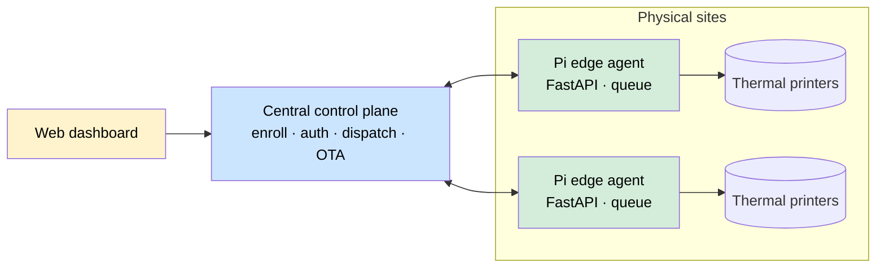
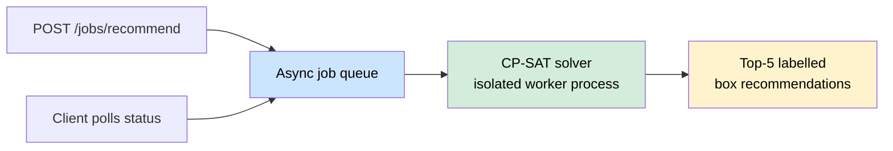
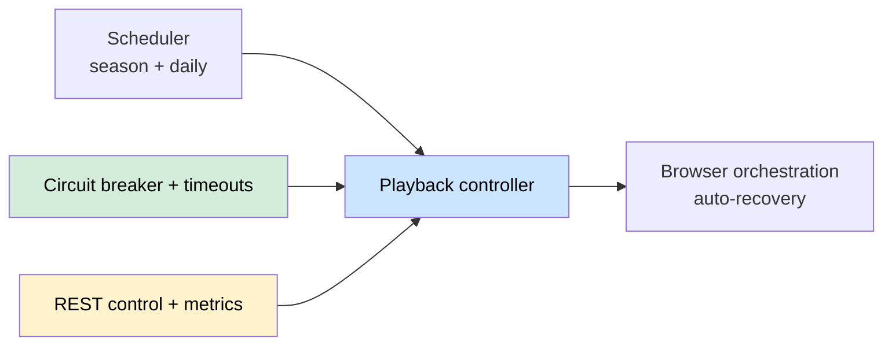
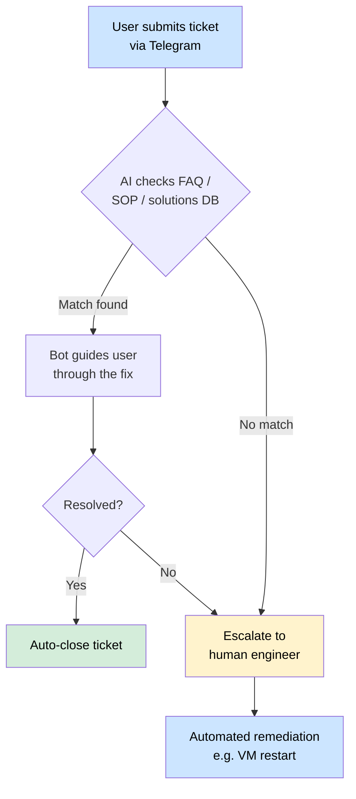
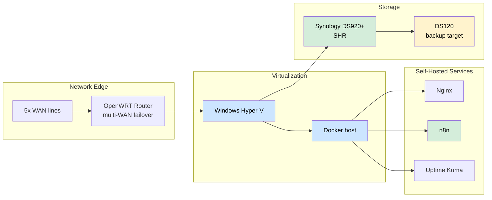
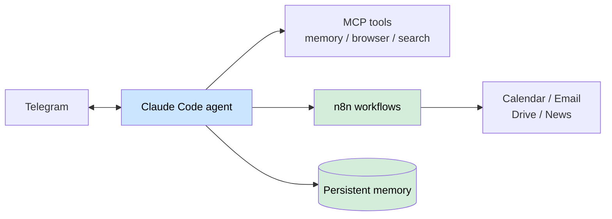

<h1 align="center">Hi, I'm Alan Fong 👋</h1>

<b>DevOps &amp; Automation Engineer</b> · Johor Bahru, Malaysia

I build and run the systems that keep a business operating — integrating AI into workflows so people have more time to focus on high-quality work.

  🌐 <a href="https://alanfong93.github.io">Portfolio site</a> ·
  💼 <a href="https://www.linkedin.com/in/alan-fong">LinkedIn</a>

---

## 🧰 Tech Stack

| Area | Tools |
|---|---|
| **Languages** | Python · PHP · JavaScript · PowerShell · Bash |
| **Containers & Virtualization** | Docker · Docker Compose · Windows Hyper-V · Proxmox VE |
| **Cloud** | AWS · Google Cloud Platform · Google Workspace (admin) |
| **Automation / AI** | n8n · Claude Code · LLM agents · Whisper · Telegram Bot API |
| **Networking** | OpenWRT · pfSense · multi-WAN · VPN (SoftEther, Twingate) · Cloudflare Tunnel |
| **Infra / DevOps** | Nginx · CI/CD (GitHub Actions) · Uptime Kuma |
| **Storage / NAS** | Synology DSM · SHR / RAID · automated backups |
| **Security** | YubiKey · Action1 patch management |

---

## 🚀 Featured Work

### Distributed Print-Fleet Service
A self-hosted platform that turns USB thermal printers into a managed, multi-site network resource. **Raspberry Pi edge agents** expose printers over an authenticated HTTP API with idempotent, reboot-safe job queues; a **central control plane** handles terminal enrollment, token-scoped auth, dispatch, webhook callbacks, and over-the-air fleet updates — with a web dashboard and hardened systemd deployment.
`Python` · `FastAPI` · `Distributed systems` · `Raspberry Pi` · `SQLite/Postgres` · `Docker` · `OTA`

### Package Optimization Service
A **FastAPI** microservice that recommends the optimal shipping box using **3D bin-packing** (Google OR-Tools CP-SAT). Packing runs as **async background jobs** with progress polling; the solver enforces fragility, weight-stacking and rotation constraints, caches recurring scenarios, and runs in **isolated worker processes** so a native solver fault degrades a single box instead of the whole API. 200+ tests, Dockerized.

> **Origin:** rebuilt from a flawed AI-generated prototype into a production-grade service.

`Python` · `FastAPI` · `OR-Tools (CP-SAT)` · `Async jobs` · `Optimization` · `Docker`

### Scheduled Broadcast Automation
A Python service that automates scheduled audio/radio playback — time- and season-aware playlist switching, browser orchestration with automatic recovery, and a **REST control + metrics API**. Reliability-first: **circuit breakers**, timeout management, Pydantic-validated config with hot reload, and 118+ tests.
`Python` · `REST API` · `Pydantic` · `Circuit breaker` · `Scheduling`

### AI-Powered IT Support Bot
An LLM-backed Telegram bot that automates first-line (L1) IT support end-to-end: tickets are checked against an FAQ/SOP/solutions knowledge base, the bot guides users through known fixes, and escalates only what needs a human — with common remediations (e.g. automated VM restarts) wired into the flow.

> **Impact:** handles routine L1 tickets end-to-end, freeing the IT team to focus on higher-value engineering instead of repetitive support.

### Self-Hosted IT Infrastructure (built from scratch)
As the first IT hire at an SME, I designed and built the entire IT function from zero — network edge, virtualization, self-hosted services, central storage, backups, and security. File storage runs on a **Synology DS920+ (SHR)**, replicated to a dedicated Synology backup target.

---

## 🤖 AI Projects

### JoJo — Personal AI Assistant
An agentic assistant built on **Claude Code**, reachable over Telegram. It manages calendar, email, notes and files, runs automations through n8n, drives a browser for research, and keeps **persistent cross-session memory** via custom MCP (Model Context Protocol) servers.

### Hermes — Self-Hosted Speech-to-Text
A containerized **Whisper** (faster-whisper) transcription service running fully local with zero per-call API cost — powering voice-message transcription inside automation pipelines.
`Whisper` · `Docker` · `Python`

---

## 🏢 Enterprise Systems — Current Role
*Built for an SME; kept high-level to respect confidentiality.*

- **HR & attendance** — in-house card-tap system replacing an off-the-shelf biometric solution
- **IT ticketing & asset/stock management** — internal tools for requests and hardware tracking
- **Order automation** — automated sales/delivery order generation, removing manual data entry
- **Warehouse management** — multi-courier dispatch, consignment notes and stock tracking (maintained & extended)
- **Order follow-up & automated reporting** — internal follow-up system plus scheduled reports delivered hands-free
- **Team development** — mentored a colleague with little programming background to design and ship an OCR-driven automation end-to-end, turning a non-developer into the project's primary author

---

## 🛠 Selected Open-Source Projects

| Project | What it is | Stack |
|---|---|---|
| **KupuPost** | Notification delivery system — multi-recipient messaging, testable design | Python |
| **telegrambots** | Reusable Telegram bot framework — Dockerized, documented API | Python · Docker |
| **database-sensei** | Multi-driver database tool (SQLAlchemy 2.0+) with a full-stack UI | Python |
| **WindowsOptimizationsScript** | Windows debloat/optimization — registry & VM tuning | PowerShell |
| **screenRuler** | On-screen measurement utility, cross-implemented in two languages | Python · C# |

---

## 💼 Experience

- **IT Manager** — Modern Zone Marketing Sdn Bhd · *Jun 2020 – Present* — first IT hire; built and lead the entire IT function (infrastructure, networking, support, small engineering team); drove automation, self-hosting and AI tooling; mentored team members, including growing a non-developer into a shipping contributor.
- **Chief / Senior Technician** — Meadow Computer & System Sdn Bhd · *2013 – 2020* — managed up to four technicians, ran after-sales services, automated manual workflows, maintained an in-house service/warranty system.
- **Software Engineer Intern** — GNey Software · *2018*

## 🎓 Education & Certifications

- **Bachelor's Degree, Information Technology (Software Engineering)** — Southern University College · *2014–2018*
- **Google IT Support Professional Certificate** — *2024*

---

## 🧭 How I Work
- **Conventional Commits** + **branch-based PRs** with CI-based automated code review
- **Docs-first** — architecture/flow docs and Mermaid diagrams in each repo
- **Automation-first** — if a task is repetitive, it gets a pipeline

<i>Most implementation code lives in private repos — this profile highlights architecture, decisions, and outcomes.</i>

