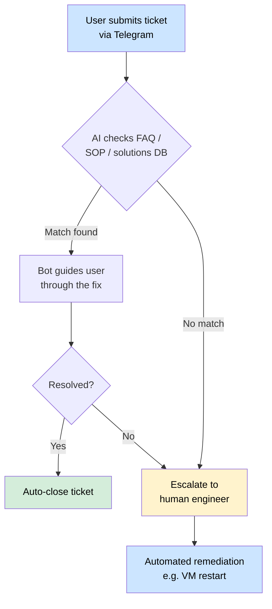
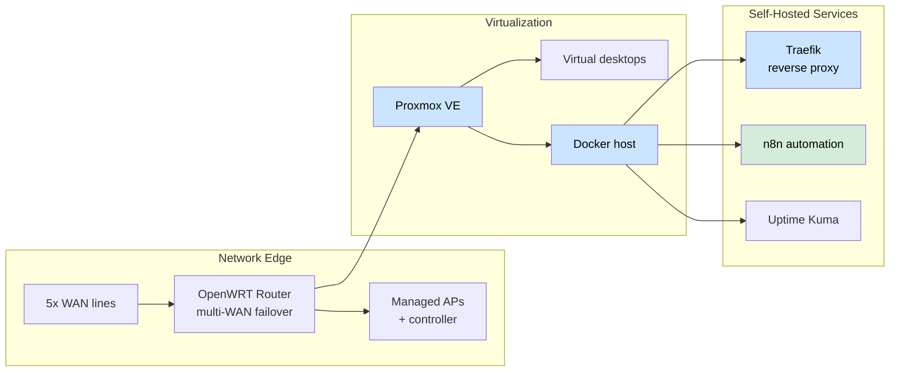

<h1 align="center">Hi, I'm Alan Fong 👋</h1>

<b>DevOps &amp; Automation Engineer</b> · Johor Bahru, Malaysia

I build and run the systems that keep a business operating — then automate the parts that shouldn't need a human.

  🌐 <a href="https://alanfong93.github.io">Portfolio site</a> ·
  💼 <a href="https://www.linkedin.com/in/alan-fong">LinkedIn</a>

---

## 🧰 Tech Stack

| Area | Tools |
|---|---|
| **Languages** | Python · PHP · JavaScript · PowerShell · Bash |
| **Containers & Virtualization** | Docker · Docker Compose · Proxmox VE |
| **Cloud** | AWS · Google Cloud Platform · Google Workspace (admin) |
| **Automation / AI** | n8n · LLM agent tooling · Telegram Bot API |
| **Networking** | OpenWRT · pfSense · multi-WAN · VPN (SoftEther, Twingate) |
| **Infra / DevOps** | Traefik · Ansible · CI/CD (GitHub Actions) · Uptime Kuma |
| **Security** | YubiKey · Action1 patch management |

---

## 🚀 Featured Work

### AI-Powered IT Support Bot
An LLM-backed Telegram bot that automates first-line (L1) IT support end-to-end: users submit tickets in chat, the bot checks them against an FAQ/SOP/solutions knowledge base, guides users through known fixes, and escalates only what truly needs a human — with common remediations (e.g. automated VM restarts) wired straight into the flow.

> **Impact:** effectively replaced the L1 support tier — a departing L1 role did not need to be backfilled.

### Self-Hosted IT Infrastructure (built from scratch)
As the first IT hire at an SME, I designed and built the entire IT function from zero — network edge, virtualization, self-hosted services, backups, and security — and run it hands-on as it scales.

### n8n Automation Platform
A self-hosted **n8n** platform that turns repetitive operational work into reliable, observable pipelines — from business workflows (automated order creation, a tap-card HR/attendance system) to a personal AI-assistant suite wired to local and cloud LLMs.

---

## 🛠 Selected Projects

| Project | What it is | Stack |
|---|---|---|
| **KupuPost** | Notification delivery system, multi-recipient messaging, testable design | Python |
| **telegrambots** | Reusable Telegram bot framework — Dockerized, documented API | Python · Docker |
| **database-sensei** | Multi-driver database tool (SQLAlchemy 2.0+) with a full-stack UI | Python |
| **WindowsOptimizationsScript** | Windows debloat/optimization — registry & VM tuning | PowerShell |
| **screenRuler** | On-screen measurement utility, cross-implemented in two languages | Python · C# |

---

## 🧭 How I Work

- **Conventional Commits** and **branch-based PRs** with **CI-based automated code review**
- **Docs-first** — architecture/flow docs and Mermaid diagrams in each repo
- **Automation-first** — if a task is repetitive, it gets a pipeline

<i>Most implementation code lives in private repos — this profile highlights architecture, decisions, and outcomes.</i>

